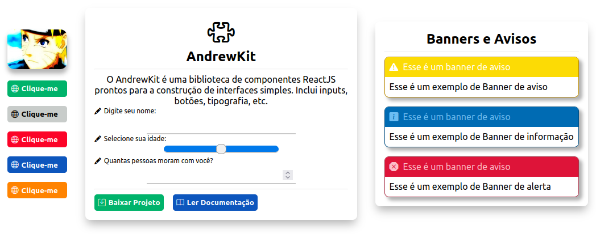

# ANDREWKIT (ALPHA)

**STEPS TO BEGIN USING ANDREWKIT:** 

Download and extract it into the `/src` folder in your project and begin importing the components.

*Please also import Bootstrap Icons into your project, since some AndrewKit components depend on them.*

`<link rel="stylesheet" href="https://cdn.jsdelivr.net/npm/bootstrap-icons@1.7.2/font/bootstrap-icons.css">`

---
AndrewKit comes with the following components available for use:

- Button
- Card
- Icon
- Input (BETA)
- Picture
- Slide
- Typography
- Banner
- Menu(Coming Soon)
- Modal(Coming Soon)
- Floating Button(Coming Soon)

You can customize them using the built-in properties inherent to them, but most of them are also customizable via the `customCSS` prop.

Here's an example of what they look like:



Here are some examples of Button, Card and Input components:

```tsx
import Button from "./AndrewKit/button/button.component";

<Button
    title={"Clique-me"}
    appearance={"success"}
    hint={"text"}
    icon={"globe"}
    action={() => window.alert("clicked")}
    disabled={true}
/>
```

```tsx
import Card from "./AndrewKit/card/card.component";
import Typography from "./AndrewKit/typography/typography.component";
import Icon from "./AndrewKit/icon/icon.component";

<Card header={
    <>
        <Icon icon={"puzzle"} size={"3rem"}></Icon>
        <br/>
        <Typography variant="h4">AndrewKit</Typography>
    </>
    }
    footer={
        <Typography variant="h4">Footer</Typography>
    }
    customCSS={{
        width: "33%",
        margin: "1rem"
    }}
    >
    <Typography variant="paragraph">
        O AndrewKit é uma biblioteca de componentes ReactJS prontos para a construção 
        de interfaces simples. Inclui inputs, botões, tipografia, etc.
    </Typography>
    </Card>
</div>
```

```tsx
import Input from "./AndrewKit/input/input.component";

<Input 
    type={"text"} 
    label="Digite seu nome: " 
    showLabel
></Input>
<Input 
    type={"range"} 
    label="Selecione sua idade: " 
    showLabel
></Input>
```